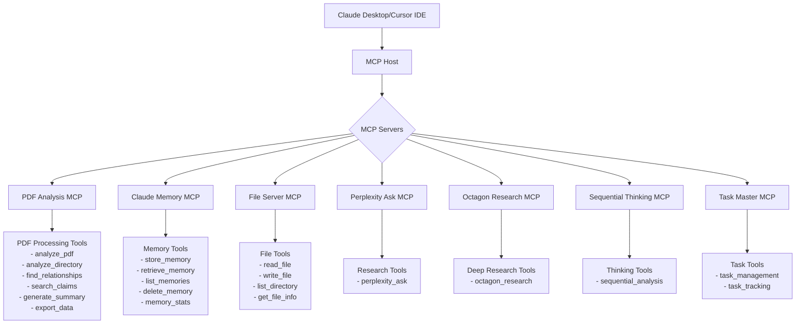

# mcp-research-toolkit

Copyright (c) 2024 Kanyuchi. All rights reserved.
Licensed under the MIT License. See LICENSE file for details.

A comprehensive toolkit for building and managing Model Context Protocol (MCP) servers, with specific focus on PDF analysis and thesis writing assistance.

## Component Ownership

This project includes several MCP components with different ownership:

- **PDF Analysis MCP** (Custom Component): Copyright (c) 2024 Kanyuchi
- **Claude Memory MCP** (Custom Component): Copyright (c) 2024 Kanyuchi
- **File Server MCP**: Based on standard MCP implementations
- **Other MCPs**: Third-party implementations (Perplexity, Octagon, etc.)

## 🌟 Features

- **PDF Analysis MCP Server**: Advanced PDF processing and analysis capabilities
- **Claude Memory Integration**: Persistent memory system for improved context awareness
- **Thesis Writing Tools**: Specialized tools for academic research and writing
- **Multiple MCP Server Types**: Support for various MCP servers including Perplexity, Octagon, and Sequential Thinking

## 🏗️ Architecture



## 📋 Prerequisites

- Python 3.8+
- Node.js 14+
- Virtual environment tool (venv)
- Git

## 🚀 Getting Started

1. Clone the repository:
   ```bash
   git clone [repository-url]
   cd Mcp_Build_Protocol
   ```

2. Set up configuration:
   - Copy example configuration files and add your API keys:
     ```bash
     cp pdf_analysis_mcp/claude_desktop_config.example.json pdf_analysis_mcp/claude_desktop_config.json
     ```
   - Update the configuration with your API keys

3. Set up Python environment:
   ```bash
   cd pdf_analysis_mcp
   python -m venv venv
   source venv/bin/activate  # On Windows: venv\Scripts\activate
   pip install -r requirements.txt
   ```

4. Set up Node.js dependencies:
   ```bash
   cd mcp-file-server
   npm install
   ```

## 🔧 Configuration

The system requires several API keys for full functionality:
- Perplexity API key
- Octagon API key
- Other provider-specific keys as needed

Add these to your configuration files as specified in the example configurations.

## 📚 Project Structure

- `pdf_analysis_mcp/`: PDF analysis server implementation
- `claude-memory-mcp/`: Claude memory system integration
- `mcp-file-server/`: File serving capabilities
- `thesis_memory/`: Thesis writing and research tools
- `thesis-memory-system/`: Enhanced memory system for thesis work

## 🛠️ Usage

1. Start the PDF analysis server:
   ```bash
   cd pdf_analysis_mcp
   python test_fastmcp_server.py
   ```

2. Run the file server:
   ```bash
   cd mcp-file-server
   npm start
   ```

3. Configure Claude Desktop integration using the provided configuration files.

## 📖 Documentation

Detailed documentation is available in the following locations:
- `docs/`: General documentation
- `pdf_analysis_mcp/README.md`: PDF analysis server documentation
- `claude-memory-mcp/docs/`: Claude memory system documentation

## 🤝 Contributing

Contributions are welcome! Please read our contributing guidelines before submitting pull requests.

## 📄 License

This project is licensed under the MIT License - see the LICENSE file for details.

## 🔐 Security

- Never commit API keys or sensitive credentials
- Use example configuration files with placeholders
- Follow security best practices when handling sensitive data

## ⚠️ Important Notes

- Keep your API keys secure and never commit them to the repository
- Regularly update dependencies to maintain security
- Follow the provided setup instructions carefully

## 📞 Support

For support, please:
1. Check the documentation
2. Search existing issues
3. Create a new issue if needed 
