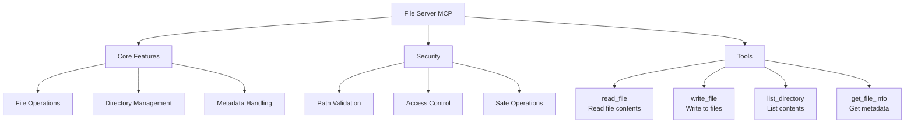

# MCP File Server

A secure and efficient file system access server implementing the Model Context Protocol (MCP). This server provides controlled access to local files and directories through a standardized interface.

## Architecture



## Features

The server provides the following tools:

- **readFile**: Read contents of a file
- **listDirectory**: List contents of a directory  
- **writeFile**: Write content to a file
- **getFileInfo**: Get information about a file or directory

## Setup

1. Install dependencies:
```bash
npm install
```

2. Start the server:
```bash
npm start
```

The server will run on `http://localhost:3000/sse`

## Usage

### Connect to MCP Client

Configure your MCP client (Claude Desktop, Cursor IDE, etc.) to connect to:
```
http://localhost:3000/sse
```

### Available Tools

#### readFile
- **Parameter**: `filePath` (string) - Path to the file to read
- **Description**: Reads and returns the contents of a file

#### listDirectory  
- **Parameter**: `dirPath` (string) - Path to the directory to list
- **Description**: Lists all files and directories in the specified path

#### writeFile
- **Parameters**: 
  - `filePath` (string) - Path to the file to write
  - `content` (string) - Content to write to the file
- **Description**: Writes content to a file

#### getFileInfo
- **Parameter**: `filePath` (string) - Path to the file or directory
- **Description**: Returns metadata about a file or directory (size, type, timestamps)

## Development

To run in development mode with auto-restart:
```bash
npm run dev
```

## Security Notes

- The server has access to the local file system where it's running
- All file paths are resolved to absolute paths
- Error handling is implemented for file operations
- Always validate and sanitize file paths in production use