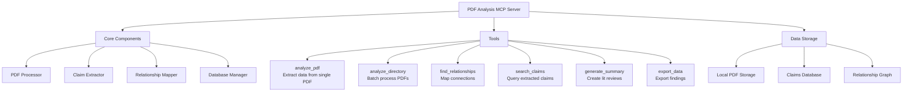

# PDF Analysis MCP Server

Copyright (c) 2024 Kanyuchi. All rights reserved.
This component is part of the MCP Build Protocol project and is licensed under the MIT License.

A Model Context Protocol (MCP) server for analyzing PDF documents, extracting claims, and mapping relationships between authors' arguments across disciplines. Designed for thesis writing and literature review workflows.

## Features

- **Local-first processing** for complete privacy
- **Multi-PDF batch analysis** 
- **Claim extraction** using NLP and LLM integration
- **Relationship mapping** between claims across papers
- **Semantic similarity analysis** 
- **Graph visualization** of claim relationships
- **Claude Desktop & Cursor integration**

## Architecture



## Installation

```bash
pip install -r requirements.txt
```

## Usage

### Start the MCP Server
```bash
python server.py
```

### Available Tools
- `analyze_pdf`: Extract claims from a single PDF
- `analyze_directory`: Process multiple PDFs in batch
- `find_relationships`: Map connections between claims
- `search_claims`: Query extracted claims by topic
- `generate_summary`: Create literature review summaries
- `export_data`: Export findings to various formats

## Configuration

### Claude Desktop
Add to `claude_desktop_config.json`:
```json
{
  "mcpServers": {
    "pdf-analysis": {
      "command": "python",
      "args": ["server.py"],
      "cwd": "/path/to/pdf_analysis_mcp"
    }
  }
}
```

### Cursor
Configure as MCP extension in Cursor settings.

## Privacy & Security

- All processing runs locally
- No cloud dependencies required
- Optional encrypted local storage
- Configurable data retention policies